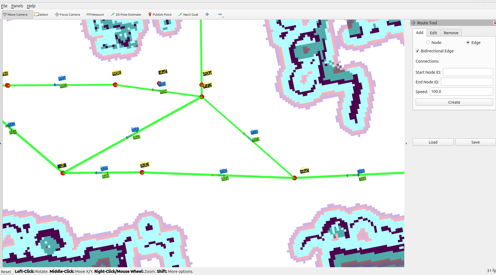

# Fork Changes

This is a fork of [ros-navigation/navigation2](https://github.com/ros-navigation/navigation2), extending the **Route Editor** (`nav2_rviz_plugins` / `nav2_route`) with a few usability and visualization improvements that are not present upstream.



## New features

### 1. One-click bidirectional edge creation
`nav2_rviz_plugins/resource/route_tool.ui`, `nav2_rviz_plugins/src/route_tool.cpp`

The "Add" tab of the Route Tool panel now has a **"Bidirectional Edge"** checkbox. When enabled (only available while the "Edge" mode is selected), clicking **Create** builds both directions of the edge (`A → B` and `B → A`) in a single action, instead of requiring the user to manually create each direction as a separate edge.

### 2. Directional arrows on the graph visualization
`nav2_route/include/nav2_route/utils.hpp`

The route graph markers (`toMsg`) now render an **arrow at the midpoint of every edge**, oriented along the direction the edge actually travels (`start → end`). This makes it possible to tell at a glance which way a directed edge points, which was previously ambiguous since overlapping edges were drawn as plain, direction-less lines.

Arrows are color-coded to match the edge-ID label next to them:
- **Orange** — unidirectional edge
- **Green/yellow** — the "outbound" edge of a bidirectional pair
- **Light blue** — the "return" edge of a bidirectional pair

### 3. More readable node/edge ID labels
`nav2_route/include/nav2_route/utils.hpp`

- Node and edge ID text markers now sit on a small background plate (a thin `CUBE` marker behind the text), so labels stay legible over any color of edge or background.
- Larger label scale and increased offset from the node/edge to reduce overlap between adjacent labels.
- Edge ID labels are colored using the same bidirectional scheme as the new arrows, so the ID, the arrow, and the edge direction are visually tied together.

### 4. Per-edge speed limit input
`nav2_rviz_plugins/resource/route_tool.ui`, `nav2_rviz_plugins/src/route_tool.cpp`

The "Add" tab, "Edge" mode now has a **"Speed:"** field, pre-filled with `100.0`, right below "End Node ID:". Its value is written into the new edge's metadata under the key `speed_limit` (as a `float`), so it is persisted when the graph is saved to `.geojson` and can be consumed directly by the existing `speed_limit`-aware edge scorers/operations (e.g. `DistanceScorer`, `AdjustSpeedLimit`) without any manual editing of the graph file.

### 5. Speed limit label on the graph visualization
`nav2_route/include/nav2_route/utils.hpp`

Edges that have a `speed_limit` value in their metadata now render it directly in the graph markers, near the **start node** of the edge (as opposed to the ID label, which sits at the midpoint) — shown as a percentage of maximum speed (e.g. `"100.0%"`), matching how `speed_limit` is already interpreted elsewhere (`AdjustSpeedLimit` logs it as "% of maximum"). The label's background is colored with the edge's own color (orange/green-yellow/blue, the same scheme as the directional arrow), with black text for contrast.

Edges without a `speed_limit` key are left untouched — no label is drawn, so older graphs that don't have this metadata aren't cluttered with a fabricated value. If the key is present but wasn't stored as a `float` (e.g. an integer written without a decimal point in a hand-edited `.geojson`), the label is skipped for that edge and a one-time warning is logged, rather than crashing the panel.

### 6. "Get Pose" button for one-click node placement
`nav2_rviz_plugins/resource/route_tool.ui`, `nav2_rviz_plugins/include/nav2_rviz_plugins/route_tool.hpp`, `nav2_rviz_plugins/src/route_tool.cpp`

The "Add" tab, "Node" mode now has a **"Get Pose"** button. Clicking it looks up the robot's current position via TF (`map → base_frame`, `base_frame` defaulting to `base_link` and configurable as a ROS parameter) and fills the "X:"/"Y:" fields with it, so a node can be placed exactly where the robot is currently standing without typing coordinates by hand. The lookup is non-blocking (`tf2::TimePointZero`, no timeout wait) so it can never hang the panel; if the transform isn't available yet, it logs a warning and leaves the fields untouched.

This also fixes a pre-existing bug: the panel's `tf2_ros::Buffer` never had a `tf2_ros::TransformListener` attached, so it never actually received any transforms — the button (and the panel's TF-dependent code in general, like cross-frame graph loading) would not have worked without this fix.

## Dependencies & Installation

No new dependencies were introduced by this fork — everything added builds on packages `navigation2` already depends on (`libqt5-widgets`/`qtbase5-dev` for the RViz panel, `visualization_msgs` for the arrow markers, `nlohmann-json-dev` for `.geojson` (de)serialization).

Tested on **ROS 2 Jazzy** (Ubuntu 24.04).

1. Clone this fork into the `src` folder of a ROS 2 workspace (alongside any other `navigation2` dependencies it needs):
   ```bash
   cd ~/nav2_ws/src
   git clone <this-fork-url> navigation2
   ```
2. Install dependencies with `rosdep` from the workspace root:
   ```bash
   cd ~/nav2_ws
   rosdep install --from-paths src --ignore-src -r -y
   ```
3. Build (at least the two affected packages, or the whole workspace):
   ```bash
   colcon build --packages-select nav2_route nav2_rviz_plugins
   # or: colcon build --symlink-install
   ```
4. Source the workspace and launch the Route Tool panel in RViz:
   ```bash
   source install/setup.bash
   ros2 launch nav2_rviz_plugins route_tool.launch.py yaml_filename:=/path/to/map.yaml
   ```
   This opens RViz already configured with the Route Tool panel (`rviz/route_tool.rviz`). It can also be added manually to any running RViz instance via **Panels → Add New Panel → nav2_rviz_plugins → RouteTool**.

## Credit

- Route Tool originally authored by John Chrosniak (2024) as part of `nav2_route`.
- Bidirectional edges, directional arrows, speed limit input, and label readability improvements above co-authored by [@marcospontoexe](https://github.com/marcospontoexe) and [Erico Meger](https://github.com/EricoMeger).
